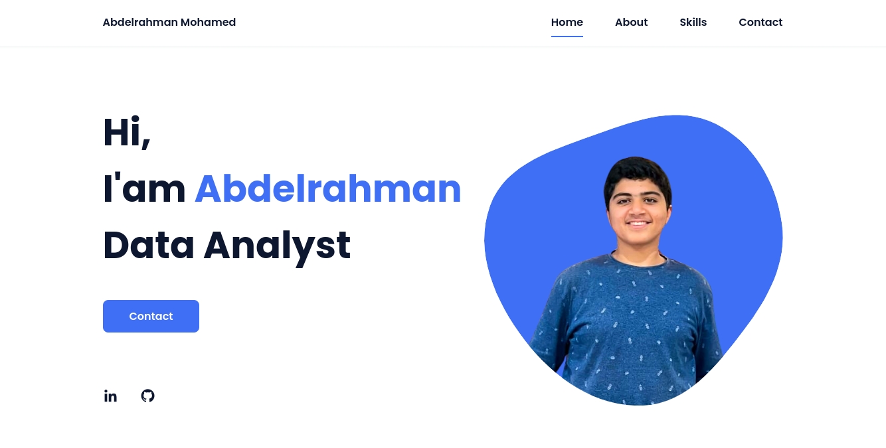

# My Personal Website
Welcome to the repository for my personal website. This website showcases my portfolio, skills, and contact information. You can view the live site [here](https://abdelrahman-mo7amed.github.io/my-website/).




## About Me

Hello! I'm Abdelrahman Mohamed, a passionate Data Analyst and Scientist with expertise in data manipulation, statistical analysis, and machine learning. I enjoy turning data into actionable insights and driving decision-making processes. Through this website, I aim to share my skills, projects, and experiences.

## Contact Details

- **Email**: amohamed.dataanalyst@gmail.com
- **LinkedIn**: [My LinkedIn](https://www.linkedin.com/in/abdelrhmanmohmed)
- **GitHub**: [My GitHub](https://github.com/Abdelrahman-Mo7amed)

## Table of Contents

- [Project Overview](#project-overview)
- [Features](#features)
- [Installation](#installation)
- [Usage](#usage)
- [Deployment](#deployment)
- [Contributing](#contributing)
- [License](#license)
- [Contact](#contact)

## Project Overview

This website is built using HTML, CSS, and JavaScript. It is a responsive website that looks great on both desktop and mobile devices. The website includes sections such as Home, About, Skills, Portfolio, and Contact.

## Features

- **Responsive Design**: Adapts to different screen sizes for optimal viewing on any device.
- **Smooth Scrolling**: Seamless navigation between sections.
- **Animated Skill Bars**: Visually appealing representation of skill levels.
- **Contact Form**: Easy way for visitors to get in touch with me.
- **Downloadable CV**: Button to download my resume directly from the website.

## Technologies Used

- **HTML5**: Structure and content of the website.
- **CSS3**: Styling and layout.
- **JavaScript**: Interactivity and dynamic content.
- **Bootstrap**: Responsive design framework.
- **GitHub Pages**: Hosting the live site.

## Installation

To set up the project locally, follow these steps:

1. **Clone the repository**:

    ```bash
    git clone https://github.com/Abdelrahman-Mo7amed/my-website.git
    ```

2. **Navigate to the project directory**:

    ```bash
    cd my-website
    ```

## Usage

Open `index.html` in your preferred web browser to view the website locally.

## Deployment

The website is deployed using GitHub Pages. Follow these steps to deploy your own version:

1. **Push your changes to GitHub**:

    ```bash
    git add .
    git commit -m "Your commit message"
    git push origin main
    ```

2. **Enable GitHub Pages**:
    - Go to your repository on GitHub.
    - Click on "Settings".
    - Scroll down to the "Pages" section.
    - Under "Source", select the `main` branch and click "Save".

After a few moments, your website will be available at `https://YOUR_USERNAME.github.io/my-website/`.

## Contributing

Contributions are welcome! Please follow these steps to contribute:

1. **Fork the repository**.
2. **Create a new branch**:

    ```bash
    git checkout -b feature/your-feature-name
    ```

3. **Make your changes**.
4. **Commit your changes**:

    ```bash
    git commit -m "Add feature: your feature name"
    ```

5. **Push to the branch**:

    ```bash
    git push origin feature/your-feature-name
    ```

6. **Create a pull request**.

## License

This project is licensed under the MIT License. See the [LICENSE](LICENSE) file for details.

## Contact

If you have any questions, feel free to reach out:

- **Email**: amohamed.dataanalyst@gmail.com
- **LinkedIn**: [My LinkedIn](https://www.linkedin.com/in/abdelrhmanmohmed)
- **GitHub**: [My GitHub](https://github.com/Abdelrahman-Mo7amed)

Thank you for visiting my website repository!
